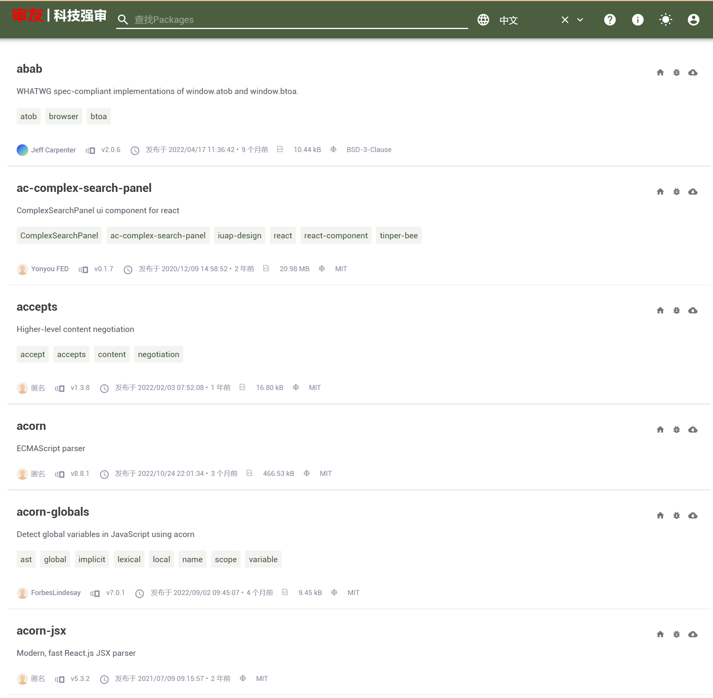

# YonyouAudit Verdaccio Docker Image

## Refer to: https://verdaccio.org/docs/en/what-is-verdaccio


## Prerequisites
* docker
* docker-compose
* You need create storage diretory in current root directory
  ```
  $ git clone https://github.com/yonyouaudit/a8-verdaccio.git
  $ cd verdaccio
  $ mkdir storage
  $ chmod 777 storage
  ```
  > Confirm the dir of `storage` have write permission.

## Diretory Arch
* docker-compose.yml  docker-compose主配置文件, 默认verdaccio的版本是4，为了内部快速拉取镜像，使用了内部映射镜像 `10.2.112.21:30050/a8/verdaccio`，但外网可以直接使用 `verdaccio/verdaccio:4` 作为基础镜像
* conf/config.yaml     verdaccio的配置文件
* storage/  verdaccio的存储目录

## How to start

```
./verdaccio-start
```
> Python version must 3.5+

otherwise, you can run

```
$ docker-compose pull
$ docker-compose start
```

## How to check log

```
$ docker-compose logs -f verdaccio
```

_注_: You should make sure you're in the `verdaccio` directory, then you can run commands related to `docker-compose`.

## Then
1. cache npmjs.org
```
$ npm registry http://[verdaccio-ip | verdaccio-domain]:4873
```
_注_: `verdaccio-ip` or `verdaccio-domain` need change to real value. 


2. publish package, flow as below



Enjoy it.

## Remove

```
$ docker-compose stop
$ docker-compose rm
```

## Upgrade

+ cache packages index!!

## More Information
1. https://github.com/verdaccio/verdaccio/tree/master/docker-examples/v4/docker-local-storage-volume

